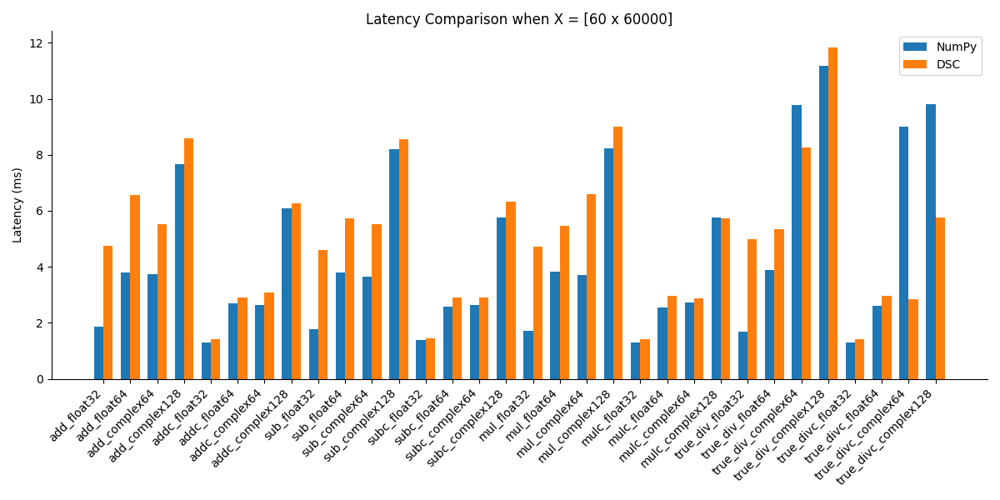
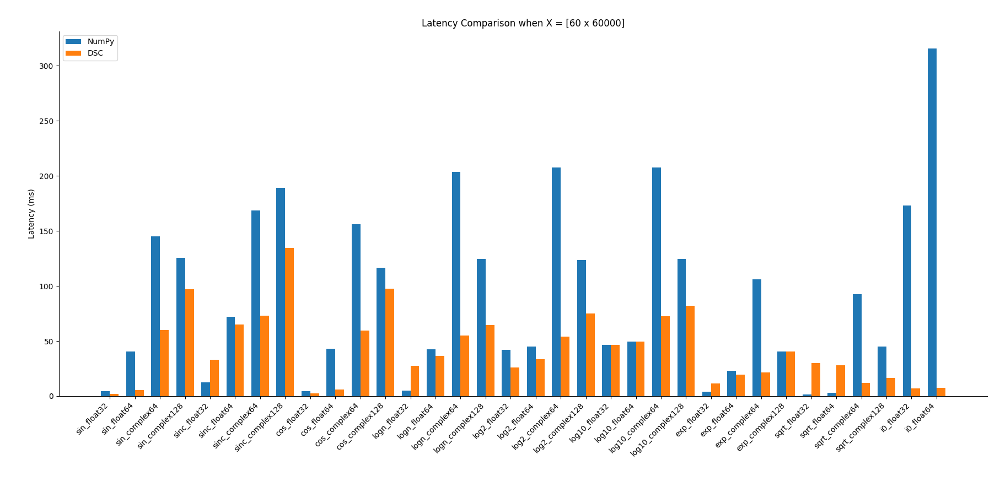
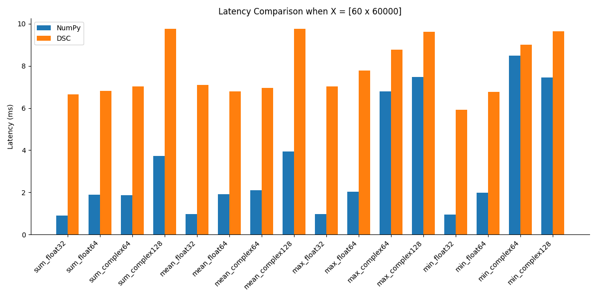
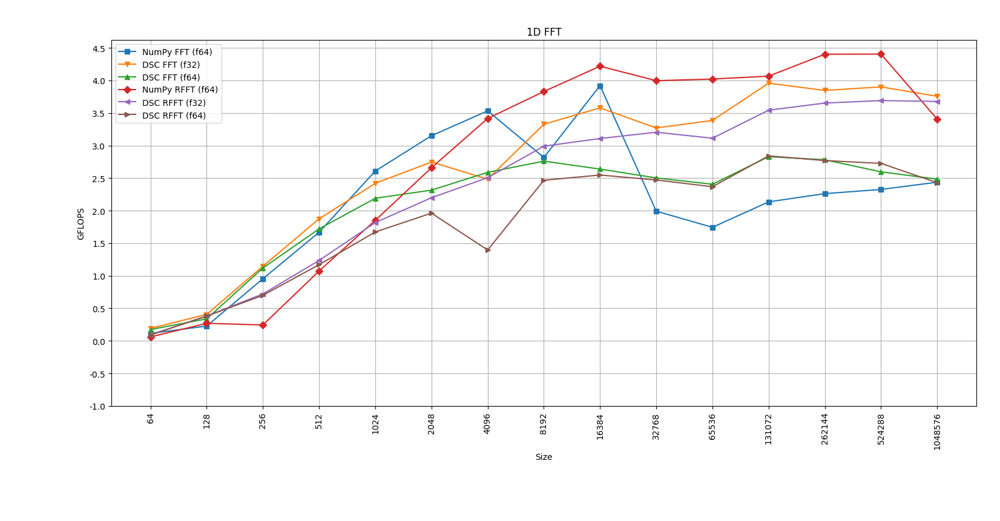

# Performance Comparison
The following is a performance comparison of DSC versus NumPy.
Of course NumPy is not the gold standard when it comes to raw performance (I plan to add
more performance-oriented comparisons in the future using the C++ API) but it's reasonably fast.
The goal here is to stay 'within reach' with respect to NumPy while maintaining a simple and intuitive API
(e.g. no 'tricks' required to achieve good performance).

## Setup
All the experiments are executed on a laptop with an Intel **i7 8750H** and **32GB of RAM** running Ubuntu-Linux 5.15.

Other settings include:
- Python 3.10.12
- GCC 11.4
- NumPy 2.0.1
- Linux 5.15
- DSC commit `6c3ae6d8a38b512627f2341f70539752ce4aef92` compiled with `DSC_FAST=1`

### Notes on Benchmarking
- All the operations that allow for an `out` parameter will have one to reduce the number of allocations in both
NumPy and DSC
- **2 warmup calls** are performed before timing each operation
- The latency of each operation is computed as the **lowest** value among **5 iterations**
- No broadcasting is involved

For more details check the scripts in `benchmarks/python`.

## Results
### Binary Operations
Binary operations are in the form `out = xa <op> xb` where:
- `xa` is always a random tensor of size [60, 60000]
- `xb` is either a random tensor of size [60, 60000] or a random scalar

### Unary Operations
Unary operations are in the form `out = op(x)` where:
- `x` is always a random tensor of size [60, 60000]

**Note:** the performance of the Bessel function of the first kind ($I_{0}$) in NumPy is 
not representative see: https://numpy.org/doc/stable/reference/generated/numpy.i0.html.

### Unary along axis
Unary along axis operations are in the form `out = op(x, axis)` where:
- `x` is always a random tensor of size [60, 60000]
- `axis` is always 0

### FFT
Benchmarking properly the FFT/RFFT operations is a bit more involved, for this reason I made the following simplifications:
- Benchmark only the forward pass
- For the FFT the number of FLOPS is computed as $5N * log_2(N)$ (see: https://www.fftw.org/speed/method.html)
this is the number of operations required by the classic radix-2 decimation in time algorithm
- For the RFFT the number of FLOPS is divided by two so $2.5N * log_2(N)$
- `out` here is not specified (since the value N is not fixed computing the output shape is not trivial)

**Note:** in the plot I purposefully ignored NumPy (f32) because NumPy will always return
an f64 and so there is no point in showing two almost identical curves.